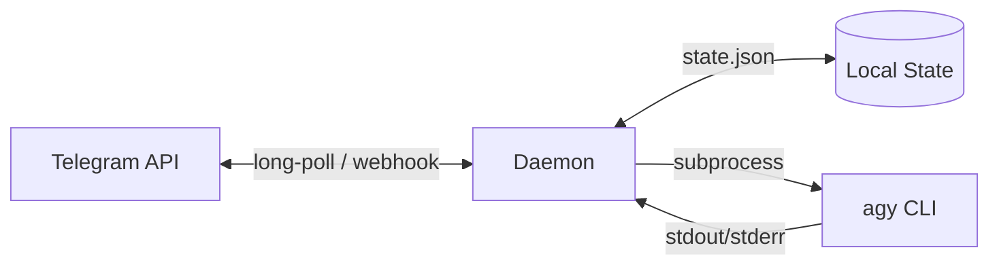

# antigravity-telegram-bridge

[English](#english) | [Русский](#русский)

---

<a name="english"></a>
## English

A lightweight Telegram bridge for interacting with the [Antigravity CLI (agy)](https://antigravity.google) directly from your messenger.

Forked and optimized for `agy`. The core feature is strict session isolation. A dedicated working directory and an independent `agy` process are spawned for each chat (or supergroup topic). Sessions do not overlap, and context is preserved across messages.

**Stack & Features:** Python 3.11+, systemd `--user`, background FIFO queueing, webhooks.

### Key Features
* **Full agy Proxying:** Forwards prompts, image uploads, and documents.
* **Environment Isolation:** Separate folders per chat. Supports `--new-project` and `--continue`.
* **Inline Control Panel:** Select AI model, execution mode, reasoning effort, and timeouts directly in the chat via `/settings`.
* **Group Chat Ready:** Correctly handles bot mentions (e.g., `/command@botname`) and forum topics.
* **Resilience:** 
  - Spam protection (sliding window rate limiter).
  - Memory consumption control with automatic restarts (OOM-gate).
  - Zombie process reaping and garbage collection.
* **Deployment:** Ready-to-use systemd units, Prometheus (`/metrics`), and health checks.

### Setup & Installation
Requires Linux, Python ≥3.11, the `uv` package manager, and a pre-authenticated `agy` CLI in your `$PATH`.

1. **Create a bot** via [@BotFather](https://t.me/BotFather) and save the token. Find your Telegram ID via [@userinfobot](https://t.me/userinfobot).
   > **Important:** If you plan to use the bot in a group chat, you must disable **Group Privacy** in BotFather settings; otherwise, the bot will not receive standard text messages.
2. **Authorize agy** on your server:
   ```bash
   agy
   # Complete the OAuth flow in your browser
   ```
3. **Deploy the bridge:**
   ```bash
   git clone https://github.com/DiM3NT0R/agy-to-tg.git ~/.gemini/extensions/antigravity-telegram-bridge
   cd ~/.gemini/extensions/antigravity-telegram-bridge
   ./install.sh
   
   cp config.example.json config.json
   chmod 600 config.json
   ```
4. **Configure `config.json`:**
   Insert your bot token and add your ID to `allowed_user_ids`. Running public bots without whitelists is strictly discouraged as it exposes your server to arbitrary code execution.
5. **Start the service:**
   ```bash
   systemctl --user enable --now antigravity-telegram-bridge.service
   # Ensure user lingering is enabled: loginctl enable-linger $USER
   ```

### Commands
* `/settings` — Interactive settings menu (model, effort, timeouts).
* `/reset` — Force terminate the current session and start fresh.
* `/status` — Session summary, memory usage, and working directory path.
* `/image on|off` — Toggle image processing.
* `/files` — List files in the session's inbox.
* `/files clean` — Purge session files.
* `/queue` — Internal message queue statistics.

### Architecture

An asynchronous Python daemon maintains a long-polling connection with Telegram (or listens via webhooks). 
Incoming messages are pushed to a FIFO queue. The daemon extracts context (chat_id, topic) and spawns a child `agy -p` process. The `agy` stdout/stderr is intercepted and proxied back to Telegram.



### Troubleshooting
* **`Conflict: terminated by other getUpdates request`** — A duplicate bot instance is running. Ensure the service is active in only one place.
* **Bot ignores group messages** — Check Group Privacy settings in BotFather (must be Disabled). You may need to re-add the bot to the group or promote it to administrator for changes to apply.
* **Path access errors** — The daemon blocks attempts to escape the `chats_root` directory.

---

<a name="русский"></a>
## Русский

Легковесный Telegram-мост для работы с [Antigravity CLI (agy)](https://antigravity.google) прямо из мессенджера. 

Форк оригинального проекта, доработанный для комфортной работы с `agy`. Основная фича — изоляция сессий. Для каждого чата (или темы в супергруппе) создается отдельная рабочая директория и независимый процесс `agy`. Сессии не пересекаются, контекст сохраняется между сообщениями.

**Стек и особенности:** Python 3.11+, systemd `--user`, фоновая очередь (FIFO), вебхуки.

### Что внутри
* **Полное проксирование в agy:** Отправка промптов, загрузка изображений и документов.
* **Изоляция окружения:** Отдельные папки для каждого чата. Поддержка ключей `--new-project` и `--continue`.
* **Управление через Inline-кнопки:** Выбор модели нейросети, режима работы (mode), уровня усердия (effort) и таймаутов прямо в чате (`/settings`).
* **Адаптация под группы:** Корректная обработка упоминаний бота (вида `/command@botname`), поддержка топиков (форумов).
* **Отказоустойчивость:** 
  - Защита от спама (rate limiter на базе скользящего окна).
  - Контроль потребления памяти с автоматическим рестартом (OOM-gate).
  - Уборка зомби-процессов и сборка мусора.
* **Деплой:** Готовые systemd-юниты, поддержка Prometheus (`/metrics`) и health-чеков.

### Установка и запуск
Для работы требуется Linux, Python ≥3.11, менеджер пакетов `uv` и предварительно авторизованный `agy` CLI в `$PATH`.

1. **Создайте бота** через [@BotFather](https://t.me/BotFather) и сохраните токен. Узнайте свой Telegram ID через [@userinfobot](https://t.me/userinfobot).
   > **Важно:** Если бот будет работать в группе, обязательно отключите **Group Privacy** в настройках BotFather, иначе он не будет видеть обычные текстовые сообщения.
2. **Авторизуйте agy** на сервере:
   ```bash
   agy
   # Пройдите OAuth авторизацию в браузере
   ```
3. **Разверните мост:**
   ```bash
   git clone https://github.com/DiM3NT0R/agy-to-tg.git ~/.gemini/extensions/antigravity-telegram-bridge
   cd ~/.gemini/extensions/antigravity-telegram-bridge
   ./install.sh
   
   cp config.example.json config.json
   chmod 600 config.json
   ```
4. **Настройте `config.json`:**
   Впишите токен бота и добавьте свой ID в `allowed_user_ids`. Запуск публичных ботов без вайтлистов строго не рекомендуется — это прямой путь к исполнению произвольного кода на вашем сервере.
5. **Запустите службу:**
   ```bash
   systemctl --user enable --now antigravity-telegram-bridge.service
   # Убедитесь, что для вашего юзера включен linger: loginctl enable-linger $USER
   ```

### Доступные команды
* `/settings` — графическое меню настроек (выбор модели, effort, таймаутов).
* `/reset` — принудительно завершить текущую сессию и начать новую с чистого листа.
* `/status` — сводка по текущей сессии, потреблению памяти и пути к рабочей директории.
* `/image on|off` — включить/отключить обработку загружаемых изображений.
* `/files` — список файлов во входящей директории сессии.
* `/files clean` — очистка файлов сессии.
* `/queue` — статистика внутренней очереди сообщений.

### Архитектура работы
Под капотом крутится асинхронный демон на Python, который держит long-polling соединение с Telegram (или слушает вебхуки). 
При получении сообщения демон ставит его в FIFO-очередь, извлекает нужный контекст (chat_id, тему) и спавнит дочерний процесс `agy -p`. Вывод `agy` перехватывается и отправляется обратно в Telegram.


### Траблшутинг
* **`Conflict: terminated by other getUpdates request`** — запущен дубликат бота. Убедитесь, что сервис запущен только в одном экземпляре.
* **Бот не отвечает в группе** — проверьте настройки Group Privacy в BotFather (должно быть Disabled). После изменения настройки может потребоваться передобавить бота в группу или выдать ему права администратора.
* **Ошибки доступа к путям** — демон блокирует попытки выхода за пределы `chats_root`.
