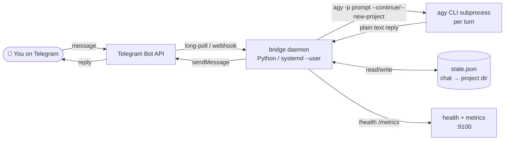
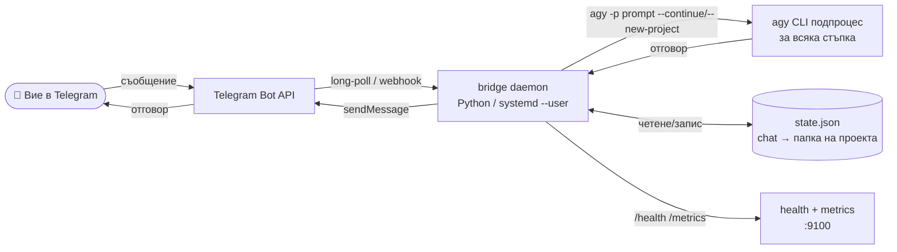

# 🤖 antigravity-telegram-bridge

[](https://www.python.org/downloads/)
[](./tests)
[](./LICENSE)
[](https://systemd.io/)
[](https://antigravity.google)

Chat with the [Antigravity CLI](https://antigravity.google) (`agy`) from Telegram.

Forked from `hah23255/kimi-to-im` and adapted to drive Google's `agy` CLI instead of the discontinued `gemini` CLI. Each Telegram chat gets its own `agy` project/working directory so sessions persist across messages while staying isolated from one another.

**Self-hosted · single-user · Python · systemd-supervised · webhook-ready**

[English](#english) · [Български](#български)

---

## English

### What it is
A Telegram bridge daemon for the Google Antigravity CLI (`agy`), allowing persistent, isolated code editing sessions over Telegram chats. Version: `0.1.1`.

### Features
| Feature | Status |
|---|---|
| Telegram ↔ `agy` messaging | ✅ |
| Per-chat project isolation (`--new-project` / `--continue`) | ✅ |
| Inline keyboard control panel (`/settings`, `/model`, `/mode`) | ✅ |
| Photo + document upload support | ✅ |
| Multi-user FIFO turn queue | ✅ |
| Webhook mode with HMAC verification | ✅ |
| Health endpoint (`/health`) and Prometheus metrics (`/metrics`) | ✅ |
| `systemd --user` service with hardening | ✅ |
| Plugin tool for `agy` (`bridge start/stop/status/logs/setup`) | ✅ |
| 112 tests, 100 % pass | ✅ |

### Quickstart

You need: Linux with `systemd --user`, Python ≥3.11, `uv`, a working `agy` CLI on `PATH`, and an authenticated `agy` session.

1. **Get a Telegram bot token** from [@BotFather](https://t.me/BotFather).
2. **Get your Telegram user ID** from [@userinfobot](https://t.me/userinfobot).
3. **Authenticate `agy` once** in a terminal:
   ```bash
   agy
   # complete the browser OAuth flow
   ```
4. **Install the bridge.**
   ```bash
   git clone https://github.com/hah23255/agy-to-im.git \
     ~/.gemini/extensions/antigravity-telegram-bridge
   cd ~/.gemini/extensions/antigravity-telegram-bridge
   ./install.sh
   cp config.example.json config.json
   chmod 600 config.json
   $EDITOR config.json   # fill bot_token + allowed_user_ids
   systemctl --user start antigravity-telegram-bridge.service
   ```

For the full step-by-step guide see `docs/deployment.md`. Day-to-day operations are in `docs/operations.md`.

### Configuration
```json
{
  "telegram": {
    "bot_token": "1234567890:...",
    "allowed_user_ids": [123456789],
    "allowed_chat_ids": []
  },
  "agy": {
    "chats_root": "",
    "default_workdir": "",
    "model": "",
    "mode": "code"
  }
}
```

### Text Commands
* `/start` - Welcome message
* `/help` - Usage help
* `/status` / `/info` - Session summary
* `/settings` - Inline control panel (model, mode, reset)
* `/reset` - Start a fresh `agy` project for this chat
* `/image on|off` - Toggle photo processing
* `/queue` - Queue status

### Architecture Mapping


### Fault Handling Manual
| Status / Error | Root Cause | Mitigation |
| :--- | :--- | :--- |
| `ModuleNotFoundError: No module named 'httpx'` | The daemon was started using the global python binary instead of the local virtual environment `.venv`. | Ensure the systemd unit or script runs within the project's virtual environment (`.venv/bin/python`). |
| Unauthorized / Token Rejected | The Telegram Bot API token is incorrect, expired, or blocked. | Check that `config.json` contains a valid bot token from BotFather. |
| Access Denied (User ID Whitelist) | The Telegram user ID sending messages is not in the whitelisted `allowed_user_ids` config array. | Add your user ID obtained from userinfobot to `config.json` and restart the daemon. |
| `systemd --user` service fails | The systemd user daemon cannot start the service (commonly due to missing user lingering). | Run `loginctl enable-linger` as root/user to allow user session daemons to run when logged out. |
| Webhook verification fails | The incoming webhook payloads are rejected due to mismatched HMAC signatures. | Check that the webhook endpoint config matches the active bot token, and no proxy is rewriting payload bodies. |
| Chat directory traversal error | A request attempted to read/write paths outside of the whitelisted `chats_root`. | Clean state database `state.json` and ensure no inputs bypass path validation hooks in `src/state.py`. |

### Common Issues & Golden Rules
* **Golden Rule 1: Default-Deny Access Control.** Always whitelists allowed user/chat IDs. Never run public-facing bridges without a strict filter list to prevent code execution by unauthorized users.
* **Golden Rule 2: Virtual Environment Isolation.** Always execute the daemon and tools inside `.venv/` to prevent package version conflicts and runtime import issues.
* **Golden Rule 3: Webhook HMAC Protection.** Under webhook deployment, always enforce HMAC-SHA256 signature verification on incoming requests to prevent mock payload injection.
* **Golden Rule 4: Systemd User session lingering.** Always verify that `loginctl enable-linger` is active for the target user, guaranteeing the bridge daemon persists across terminal logouts.

---

## Български

### Какво представлява
Телеграм мост (daemon) за конзолния инструмент Google Antigravity CLI (`agy`), позволяващ устойчиви, изолирани сесии за редактиране на код през чатове в Telegram. Версия: `0.1.1`.

### Възможности
| Функция | Статус |
|---|---|
| Telegram ↔ `agy` кореспонденция | ✅ |
| Изолация на проекти за всеки отделен чат (`--new-project` / `--continue`) | ✅ |
| Контролен панел с вградена клавиатура (`/settings`, `/model`, `/mode`) | ✅ |
| Поддръжка на качване на снимки и документи | ✅ |
| Многопотребителска FIFO опашка за изчакване | ✅ |
| Webhook режим с HMAC верификация | ✅ |
| Здравна точка (`/health`) и Prometheus метрики (`/metrics`) | ✅ |
| `systemd --user` услуга със защити | ✅ |
| Инструмент-плъгин за `agy` (`bridge start/stop/status/logs/setup`) | ✅ |
| 112 теста, 100 % преминаване | ✅ |

### Бърз старт

Необходими са: Linux със `systemd --user`, Python ≥3.11, `uv`, работещ `agy` в системния път (`PATH`) и оторизирана сесия в `agy`.

1. **Вземете Telegram бот токен** от [@BotFather](https://t.me/BotFather).
2. **Вземете Вашия Telegram ID** от [@userinfobot](https://t.me/userinfobot).
3. **Оторизирайте `agy` веднъж** в конзолата:
   ```bash
   agy
   # завършете браузърния OAuth процес
   ```
4. **Инсталирайте моста.**
   ```bash
   git clone https://github.com/hah23255/agy-to-im.git \
     ~/.gemini/extensions/antigravity-telegram-bridge
   cd ~/.gemini/extensions/antigravity-telegram-bridge
   ./install.sh
   cp config.example.json config.json
   chmod 600 config.json
   $EDITOR config.json   # попълнете bot_token + allowed_user_ids
   systemctl --user start antigravity-telegram-bridge.service
   ```

За пълно ръководство вижте `docs/deployment.md`. Ежедневната експлоатация е описана в `docs/operations.md`.

### Конфигурация
```json
{
  "telegram": {
    "bot_token": "1234567890:...",
    "allowed_user_ids": [123456789],
    "allowed_chat_ids": []
  },
  "agy": {
    "chats_root": "",
    "default_workdir": "",
    "model": "",
    "mode": "code"
  }
}
```

### Текстови команди
* `/start` - Добре дошли
* `/help` - Помощ при ползване
* `/status` / `/info` - Обобщение на сесията
* `/settings` - Контролен панел (модел, режим, ресет)
* `/reset` - Стартиране на нов `agy` проект за този чат
* `/image on|off` - Включване на обработка на снимки
* `/queue` - Статус на опашката

### Архитектурно описание


### Ръководство за отстраняване на неизправности
| Статус / Грешка | Причина | Решение |
| :--- | :--- | :--- |
| `ModuleNotFoundError: No module named 'httpx'` | Демонът е стартиран с глобалния python, вместо с локалната виртуална среда `.venv`. | Уверете се, че systemd услугата или скриптът стартират чрез виртуалната среда (`.venv/bin/python`). |
| Невалиден токен (Rejected) | Токенът за Telegram Bot API е грешен, изтекъл или блокиран. | Проверете дали `config.json` съдържа валидния токен, получен от BotFather. |
| Отказан достъп (Whitelist) | Потребителят, изпращащ съобщения, не е в белия списък `allowed_user_ids`. | Добавете вашия ID (получен от userinfobot) в `config.json` и рестартирайте процеса. |
| Срив на `systemd --user` | Потребителският systemd не може да стартира услугата (обикновено поради липса на linger). | Изпълнете `loginctl enable-linger` като root/user, за да позволите на потребителските услуги да работят след изход. |
| Webhook верификацията се проваля | Входящите webhook съобщения се отхвърлят поради несъответствие в HMAC подписите. | Проверете дали конфигурацията съответства на активния токен и че няма прокси, което променя тялото на заявката. |
| Грешка в пътя на сесията | Опит за четене/запис извън разрешената директория `chats_root`. | Изчистете базата данни `state.json` и се уверете, че промените се правят съгласно правилата в `src/state.py`. |

### Чести проблеми и Златни правила
* **Златно правило 1: Достъп с отказ по подразбиране.** Винаги задавайте бели списъци за потребители. Никога не стартирайте публични ботове без стриктни филтри за достъп за избягване на злоупотреби.
* **Златно правило 2: Изолация на виртуалната среда.** Винаги стартирайте демона и инструментите в `.venv/`, за да избегнете конфликти в библиотеките и грешки при импортиране.
* **Златно правило 3: Webhook HMAC защита.** При webhook разгръщане винаги проверявайте подписите HMAC-SHA256 на входящите заявки, за да се предпазите от фалшиви заявки.
* **Златно правило 4: Устойчивост на потребителските сесии.** Винаги проверявайте дали е активиран linger режимът (`loginctl enable-linger`) за съответния потребител, за да работи ботът и след изход от терминала.
