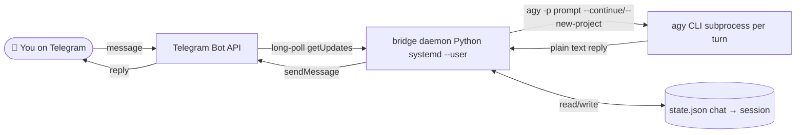

# 🤖 antigravity-telegram-bridge

Chat with the [Antigravity CLI](https://antigravity.google) (`agy`) from Telegram.

Forked from [kimi-to-im](https://github.com/hah23255/kimi-to-im) and adapted to use Google's `agy` CLI instead of the discontinued `gemini` CLI.

**Self-hosted · single-user · Python · systemd-supervised**

---

## Why this exists

`agy` runs at your desk. This bridge lets you keep the same conversation going from your phone over Telegram. Each chat gets its own working directory and session context.

**Single-user, single-host, text-first by design.** No cloud component. The bot replies only to user IDs you explicitly whitelist.

---

## Architecture



---

## Quickstart

You need: Linux with `systemd --user`, Python ≥3.11, [`uv`](https://docs.astral.sh/uv/), a working `agy` CLI on `PATH`, and an authenticated agy session.

1. **Get a Telegram bot token** from [@BotFather](https://t.me/BotFather).
2. **Get your Telegram user ID** from [@userinfobot](https://t.me/userinfobot).
3. **Authenticate agy once** in a terminal:
   ```bash
   agy
   # complete the browser OAuth flow
   ```
4. **Install the bridge.**
   ```bash
   cd ~/.gemini/extensions/antigravity-telegram-bridge
   ./install.sh
   cp config.example.json config.json
   chmod 600 config.json
   $EDITOR config.json   # fill bot_token + allowed_user_ids
   systemctl --user start antigravity-telegram-bridge.service
   ```

---

## Configuration

```json
{
  "telegram": {
    "bot_token": "1234567890:...",
    "allowed_user_ids": [123456789],
    "allowed_chat_ids": []
  },
  "agy": {
    "chats_root": "",
    "default_workdir": "",
    "model": "",
    "mode": "code"
  }
}
```

| Field | Required | Notes |
|---|---|---|
| `telegram.bot_token` | yes | From BotFather |
| `telegram.allowed_user_ids` | yes | Default-deny whitelist |
| `telegram.allowed_chat_ids` | recommended | Restrict to your DM |
| `agy.chats_root` | no | Per-chat dirs; defaults to `~/.antigravity/bridge/chats` |
| `agy.default_workdir` | no | Base cwd for agy |
| `agy.model` | no | Empty = agy default |
| `agy.mode` | no | `code` (auto) or `plan` (read-only sandbox) |

---

## Commands

- `/start` — welcome
- `/help` — usage
- `/status` — session summary
- `/settings` — inline control panel
- `/model` — pick a model
- `/mode` — pick `code` or `plan`
- `/reset` — start a fresh agy session for this chat
- `/files` — list recent uploads

---

## Development

```bash
uv venv .venv --python 3.11
uv pip install -e ".[dev]"
.venv/bin/pytest -v
```

---

## License

MIT — see [LICENSE](LICENSE).
